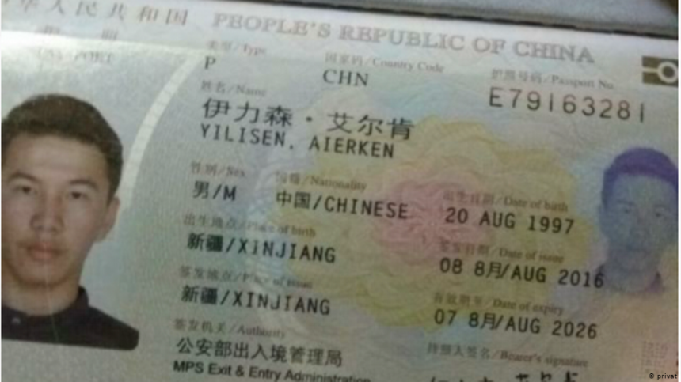

Dear Madam / Sir, embassy!

I am seeking for help on behalf of Aierken Yilisen. He is a 24 year old Kazakh refugee from Xinjiang, currently stuck in Ukraine. He was arrested last year, hold in local immigration prison and faced deportation to China. [1]

With the help of China Aid, Safeguard Defenders, local Ukrainian people and many others he gained back his freedom on Oct 27. [2]

Unfortunately today the Ukrainian Immigration Bureau rejected his refugee application thus he couldn't yet reach a safe country. As he says:
"After many doubts I completely gave up the idea of longing for freedom. I will just count the days days after day. Thank you all for this year." [3]

The Chinese communist party is (allegedly) commiting a genocide in Xinjiang against Uyghurs and other ethnic, such as Kazakh minorities. The horrific human rights abuses in Xinjiang is widely recognized by the international community, including US, Canada, UK and the European Union.

Based on the above I am kindly ask your help in order to find Aierken asylum if possible in your country. Please assist me what he can/should he do in order to receive refugee status.

Kind regards,
[Your Name Here]

References:

[1] Xinjiang man arrested in Ukraine for fear of being deported to NGOs to expose "re-education camp" shady
新疆男子乌克兰被捕恐遭遣返 非政府组织揭“再教育营”黑幕

https://m.soundofhope.org/post/451468
https://m-soundofhope-org.translate.goog/post/451468?_x_tr_sl=auto&_x_tr_tl=en&_x_tr_hl=hu&_x_tr_pto=nui

[2] "With your help, I gained freedom and gained a second life. I will never forget your kindness to me. Thank you to everyone who supported me. Thank you Ukraine."

https://twitter.com/nice1996616/status/1453370387866259463

[3] Today Immigration Bureau rejected my refugee application. I couldn’t get refugee status, I couldn’t reach a safe country. "After many doubts I completely gave up the idea of longing for freedom. I will just count the days days after day. Thank you all for this year.
今天移民局拒绝了我的难民申请，无法获得难民身份，无法到达安全国家，进退两难，终于想通了，我彻底放弃了渴望自由的念头，以后过一天算一天，真心感谢您们在这一年的支持与帮助。

https://twitter.com/nice1996616/status/1455613797687771136