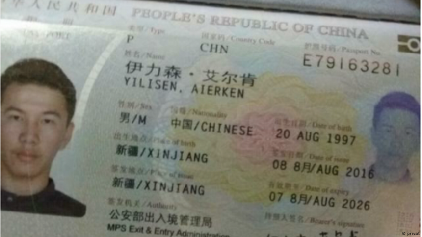
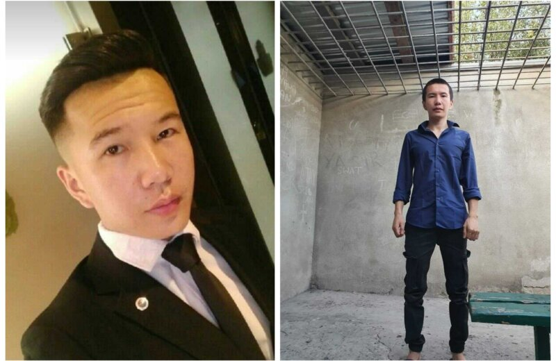

# AsylumForAerken
Seeking asylum for Aerken, a 26 year old ethnic Kazakh refugee from Xinjiang.

## Events 

In reverse chronological order:

**2021-11-03: An embassy campaign was started** to seek asylum for him: [EmbassyCampaign/README.md](EmbassyCampaign/README.md)

**2021-11-02: His refugee application was rejected**: "Today Immigration Bureau rejected my refugee application. I couldn’t reach a safe country. I was in doubts. Now I completely gave up the idea of longing for freedom. I will just count days after days."   
https://twitter.com/nice1996616/status/1455547343693090828[DeniedAsylumRequest](DeniedAsylumRequest.jpg)

**2021-10-27: He was released from prison**: "With your help, I gained freedom and gained a second life. I will never forget your kindness to me. Thank you to everyone who supported me. Thank you Ukraine."   
https://twitter.com/nice1996616/status/1453370387866259463

**2020-10: Aerken  was arrested in Ukraine** and held in local immigration prison for one year - facing possible deportation to China.   
https://m-soundofhope-org.translate.goog/post/451468?_x_tr_sl=auto&_x_tr_tl=en&_x_tr_hl=hu&_x_tr_pto=nui

**2020-08: Aerken  was arrested in Slovakia and sent back to Ukraine**

https://www.kyivpost.com/ukraine-politics/asylum-seeker-in-ukraine-receives-threats-risks-illegal-deportation-to-china.html

## Campaigns

Currently an embassy campaign (see [EmbassyCampaign/README.md](EmbassyCampaign/README.md) is running and a social media campaign (see below)

### Social media campaign

Aerken Twitter account: https://twitter.com/nice1996616

https://twitter.com/csomgyula/status/1455848504786571264
